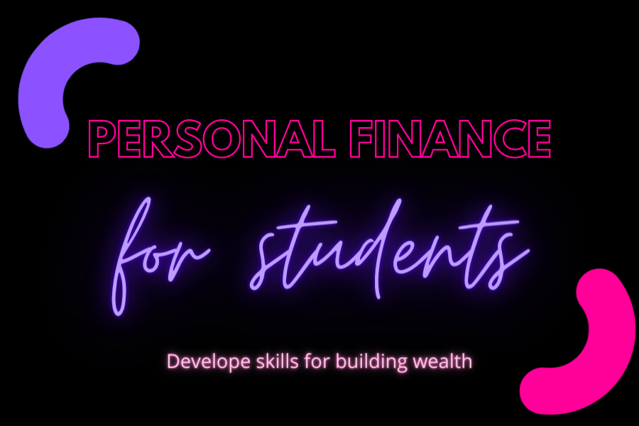

# Personal-Budgeting-Application

## Description

This program serves as a personal budgeting tool/resource for young people to get an introduction to personal finance. The goal is to empower learners to build a foundation of financial principles that led to wealth.

`While in development, a link may not be available. If you have any questions, please reach out to me at the contact details below.`

## Table of Contents
1. [Installation](#installation)
2. [Usage](#usage)
3. [License](#license)
4. [Contributing](#contributing)
5. [Questions](#questions)

## Installation
To install the necessary dependencies, run the following command: `npm i`

## Usage
Run the following command to get started: `npm start develop`

## License
This project is licensed under the MIT license.

## Contributing
If you'd like to contribute, you can reach me directly at the email address listed below.
  
## Questions
If you have any questions about the repo, open an issue or contact me directly at [amfrazier01@gmail.com](mailto:amfrazier01@gmail.com). You can find more of my work at [afrazier01](https://github.com/afrazier01)

